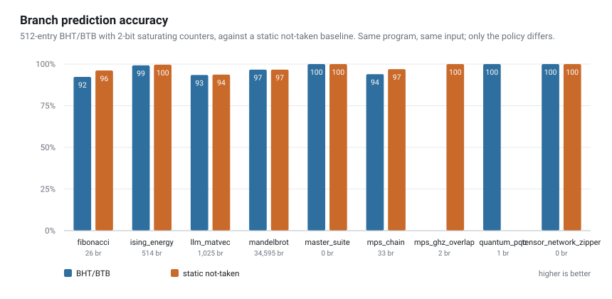
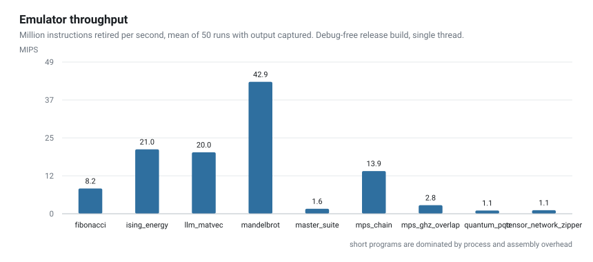
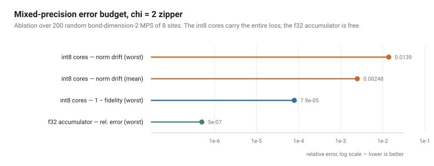

# Unibit

A 256-bit instruction set architecture, written from scratch in Rust with zero
dependencies: emulator, two-pass assembler, object format, disassembler and a
cost model.

The name is the idea. A register is **one 256-bit word**, and the instruction
decides what that word *means* — a 64-bit scalar, 32 packed bytes, two complex
numbers, or four polynomial coefficients over a finite ring. The hardware
understands types, not just widths.

```bash
cargo test          # 61 tests: 45 unit + 16 integration
cargo clippy        # clean
cargo run -- run programs/mandelbrot.uasm
```

This is a research emulator, not silicon. There is no RTL and no timing model —
what it has instead is a cost model and honest measurement. Where something falls
short it says so, in the code, marked `[KNOWN_LIMIT]`.

---

## What it does

```
        .data
msg:    .asciiz "Hello from a custom 256-bit ISA\n"

        .text
        .global _start

_start:
        la      a0, msg
        li      a7, 6              ; print_strz
        ecall

        qrand   t0                 ; 256-bit pseudo-random state
        entropy t1, t0             ; Shannon entropy of t0, in bits
        polymul t2, t0, t1         ; product in Z_q[X]/(X^4+1), q = 3329
        ntt     t3, t2             ; negacyclic number theoretic transform
        invntt  t4, t3
        hamming t5, t4, t2         ; 0 <=> the round trip was exact
        beq     t5, zero, ok

        halt
ok:
        halt
```

Assemble it, run it, or take it apart:

```bash
unibit build programs/mandelbrot.uasm -o mandelbrot.ubo
unibit run   mandelbrot.ubo
unibit disasm mandelbrot.ubo        # decodes the bytes, no AST, no symbol table
unibit bench                        # measures every program -> docs/bench.csv
```

---

## Register model

One `Reg256` is four 64-bit lanes. Instructions choose the interpretation:

| Mode | Interpretation | Used for |
|---|---|---|
| `Scalar` | 1 × 64-bit (lane 0) | ordinary RISC work |
| `Vector .d/.w/.h/.b` | 4×64 / 8×32 / 16×16 / 32×8 | SIMD, down to int8 |
| `Complex` | 2 × (f64, f64) | complex arithmetic |
| `Poly` | 4 coefficients mod q | ring R_q = Z_q[X]/(X⁴+1) |

---

## Measurements

Everything below is produced by `unibit bench` and written to
[`docs/bench.csv`](docs/bench.csv). Charts are rendered from that file by
[`tools/plot_bench.py`](tools/plot_bench.py).

### Branch prediction — including the part that did not work



The machine has a 512-entry BHT with 2-bit saturating counters and a BTB.
Benchmarking it against a static not-taken baseline gives an uncomfortable
result, so it is the first thing reported:

| Program | BHT/BTB | static not-taken | branches |
|---|---:|---:|---:|
| fibonacci | 92.3 % | **96.2 %** | 26 |
| mandelbrot | 96.65 % | **96.66 %** | 34 595 |
| quantum_pqc | **100 %** | 0 % | 1 |
| mps_ghz_overlap | 0 % | **100 %** | 2 |

**On this workload set the predictor does not beat static not-taken.** The reason
is structural rather than a bug: almost every conditional branch in these programs
is a loop-exit test, which is not-taken by construction, and an unconditional `j`
closes the loop without consulting the predictor. Static not-taken is therefore
close to optimal for this code shape. On the short programs the BHT initialises to
weakly-taken and pays a warm-up it never amortises.

A predictor earns its keep on taken-dominated backward branches. This instruction
mix does not have them. Reporting a 96 % accuracy number without the baseline
would have made the predictor look like it was working.

There *was* a real bug here, fixed and regression-tested: `update()` indexed the
BHT by the destination PC instead of the branch PC, so it never learned. Mandelbrot
predicted at 3.34 % and IPC sat at 0.71. Both numbers moved to the values above.

### What three real workloads cost this ISA

Three inner loops taken from workloads that exist outside this project, written in
Unibit assembly and measured: quantised LLM decode ([`llm_matvec.uasm`](programs/llm_matvec.uasm)),
Ising machine energy ([`ising_energy.uasm`](programs/ising_energy.uasm)) and a
256-site tensor-network contraction ([`mps_chain.uasm`](programs/mps_chain.uasm)).

| Kernel | Instructions | Flops/instruction | % of ceiling |
|---|---:|---:|---:|
| `llm_matvec` | 33 741 | 13.60 | 85 % |
| `ising_energy` | 12 599 | 10.48 | 66 % |
| `mps_chain` | 942 | **69.57** | 82 % |

`VDOT.B` retires 64 flops per instruction — the same density as AVX2's
`VPMADDUBSW` on the Xeon this is emulated on, because both are 256-bit vectors
doing int8 MACs. Width buys nothing there. `ZIPPER2` retires **256**, because it
fuses an entire bond-dimension-2 contraction into one instruction, and that is the
only place this ISA is genuinely ahead of an existing one.

The Ising kernel sits at 66 % because the ISA has no int8 × int64 dot product, so
its middle contraction falls off the vector path to 0.25 flops per instruction.
That is a real hole the measurement found, and it would cost one opcode to close.

Measured against the same machine's silicon, the GPU **loses two of the three** —
but the host numbers turn out to be 97 % framework dispatch overhead, so the
comparison does not support a throughput claim and none is made.

Full study, method, host reference and limits: **[docs/kernel-cost.md](docs/kernel-cost.md)**.

### Throughput



Mean of 50 runs, output captured, release build, single thread. Only mandelbrot
(265 783 instructions) is long enough to be a throughput measurement; the rest are
dominated by assembly and setup, and are shown for honesty rather than as results.

---

## Post-quantum lattice unit

`POLYMUL` is schoolbook negacyclic convolution in R_q = Z_q[X]/(X⁴+1).
`NTT`/`INVNTT` are the matching transform:

```
A[k] = Σⱼ a[j]·ψ^j·ω^(jk)        ω = ψ²,  ψ^N = −1
a[j] = N⁻¹·ψ^(−j)·Σₖ A[k]·ω^(−jk)
```

The `ψ^j` pre-twist is what makes the transform *negacyclic*, i.e. consistent with
the ring rather than with plain cyclic convolution. Two properties are tested, not
asserted, over 256 random inputs for q = 3329 (Kyber) and q = 8380417 (Dilithium):

- exact invertibility, `invntt(ntt(a)) == a`
- the convolution theorem, `NTT(a ⊛ b) == NTT(a) ⊙ NTT(b)`, checked against `POLYMUL`

**ψ is derived from the modulus at run time, not hardcoded.** For any base x, the
element `x^((q−1)/2N)` has order 2N with probability ½, so an ascending trial from
x = 2 converges in about two iterations and is deterministic for a given q. If
`2N ∤ q−1` the instruction traps instead of returning nonsense.

`programs/quantum_pqc.uasm` checks the round trip *in-band*: it runs
`ntt`/`invntt`, compares with `hamming`, and exits non-zero if a single bit of 256
differs.

**[KNOWN_LIMIT]** N = 4 coefficients, one per lane. Kyber uses N = 256. This is the
arithmetic primitive, not a usable KEM — there is no sampling, no packing, no
encapsulation.

---

## Tensor-network unit

`ZIPPER` and `ZIPPER2` perform one matrix-product-state contraction step. They are
**accumulator instructions**: unlike every other three-operand instruction here,
`rd` is *read* as the incoming transfer matrix before being written with the
outgoing one.

At bond dimension 2 nothing fits at f64 — the transfer matrix is 512 bits and a
core is 1024 — so the step is mixed precision, and the split is measured rather
than guessed:

- **E is f32.** It is the accumulator, carried across every site, so its error
  compounds. A 2×2 complex f32 is exactly 256 bits: one register, nothing wasted.
- **Cores are int8 with per-bond scales.** They are static data, quantised once.
  16 codes (128 bits) + 2 f32 scales (64 bits) = 192 bits.



Ablation over 200 random χ = 2 MPS of 8 sites
(`test_zipper2_error_budget_is_dominated_by_the_cores`):

```
int8 cores       fidelity   mean 0.999962, worst 0.999921
int8 cores       norm drift mean 2.5e-3,   worst 1.4e-2
f32 accumulator             worst relative error 5.0e-7
```

The cores carry the entire budget and the accumulator is four orders of magnitude
cheaper — the opposite of the naive guess. The direction of the state survives;
the magnitude drifts by a fraction of a percent. Random MPS are used deliberately:
at χ = 2 they are near-maximally entangled, so they are the hard case.

Coverage is checked by mutation rather than assumed.
[`tools/mutation_test.py`](tools/mutation_test.py) perturbs each of the eight
product terms of the contraction by 5 %: **8 of 8 are caught by `cargo test`.**

`programs/mps_ghz_overlap.uasm` computes ⟨GHZ′₄|i+⁴⟩ = (1−i)/(4√2) from assembly
and verifies both parts to **1 ULP**. Both states carry a phase on purpose — with a
real ket the accumulated E stays real and the term `conj(A).im · t.im` is never
evaluated, so the golden would silently pass with that path broken.

**[KNOWN_LIMIT]** χ = 4 does not fit at any precision: its transfer matrix needs
288 bits and its cores 544. A 256-bit word tops out at χ = 2. That is the ceiling
of the architecture, not a gap in the implementation.

---

## Object format

`unibit build` writes a real object file, and `unibit disasm` decodes it **from
bytes** — no AST, no symbol table.

Instruction record, 16 bytes, little-endian:

```
[0]      opcode        [4..8]   aux  (vector width / activation fn / CSR)
[1]      rd            [8..16]  imm  (immediate, branch offset, or u64 operand)
[2]      rs1
[3]      rs2
```

Fixed width keeps decoding seekable: instruction *i* always begins at
`code_offset + i·16`. The header carries the magic `UBIT`, a version, the entry
point and the section counts; every length is validated against the buffer before
use, so a truncated or hostile file produces an error rather than a panic.

The opcode table and both `encode_instruction` and `decode_instruction` are
generated from a single source table, so the two directions cannot drift apart.
`test_encode_decode_covers_every_opcode` round-trips every opcode in the ISA.

---

## Information theory and thermodynamics

- `ENTROPY` — Shannon entropy of the register's byte histogram, as f64 in lane 0.
  **Range is [0, 5] bits, not [0, 8]**: 32 samples, so the maximum is log₂32.
- `HAMMING`, `POPCNT` — over all 256 bits.
- `QRAND` — xoshiro-style PRNG. **Not a CSPRNG**, and the four lanes derive from a
  single u64 seed, so they are correlated. It fills test state; it does not make keys.

The machine also counts the bits it destroys — the Hamming distance between old and
new value on every register write and memory store — and applies `E ≥ k_B·T·ln2` at
a configurable temperature.

**[KNOWN_LIMIT]** This is a cost model, not a physical measurement. It counts bits
overwritten with a different value; it does not track logical reversibility, nor
the operand bits an irreversible gate consumes. Program loading is excluded on
purpose: that is the loader, not execution.

---

## Layout

```
unibit/
├── src/
│   ├── isa.rs         Reg256, Instruction, physical constants
│   ├── alu.rs         scalar, SIMD, complex, lattice, tensor, tensor-network units
│   ├── memory.rs      little-endian memory, bus and erasure counters
│   ├── cpu.rs         execution, BHT/BTB, cost model, syscalls
│   ├── assembler.rs   two-pass assembler and label linker
│   ├── binary.rs      UBIT object format, encoder/decoder
│   ├── disasm.rs      disassembler, control flow graph, entropy profile
│   └── main.rs        CLI
├── programs/          sample programs (.uasm)
├── tests/             end-to-end: source -> object -> decode -> CPU -> stdout
├── tools/             benchmark plots, mutation testing
└── docs/              measured data and charts
```

---

## What this is not

- Not a processor. No RTL, no synthesis, no timing.
- Not a usable Kyber or Dilithium. N = 4 arithmetic primitives only.
- The Landauer counter is a cost model, not a physical measurement.
- The tensor-network engine stops at χ = 2, and the register width is why.
- `QRAND` is not cryptographically secure.
- There is no pipeline: 1 cycle per instruction, +3 on division, +3 on a
  mispredict. A cost model, not simulated stages.

## Licence

MIT
